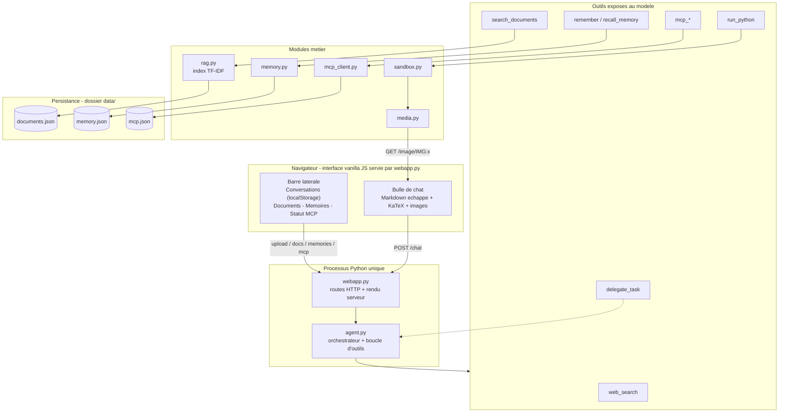
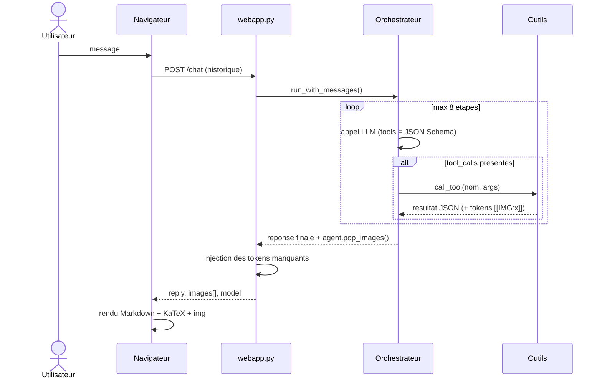
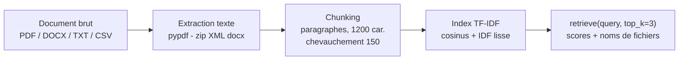

# Architecture — AI Services

Agent IA conversationnel **sans framework** : boucle tool-calling maison, multi-provider,
RAG sur documents, mémoire long terme, interpréteur de code sandboxé avec affichage de
graphiques dans le chat, sous-agents spécialisés et outils externes MCP.

---

## 1. Vue d'ensemble

Un seul processus Python héberge tout : le serveur web, l'agent, les modules métier et
les connexions MCP. C'est ce qui permet le pipeline d'images sans stockage externe.

---

## 2. Flux d'une requête de chat

Point clé : les images produites par la sandbox sont captées **à la source** (buffer
thread-local) puis réinjectées dans la réponse même si le modèle oublie de mentionner
le token. L'affichage ne dépend pas de la discipline du modèle.

---

## 3. L'orchestrateur (`agent.py`)

- **Multi-provider** : Ollama, Groq, OpenRouter, OpenAI — toute API compatible OpenAI
  (`/chat/completions`), sélection par variables d'environnement.
- **Boucle d'outils** (`run_loop`) : jusqu'à `max_steps` allers-retours ; chaque
  `tool_call` est exécuté puis renvoyé au modèle au format `role: tool`.
- **Robustesse** : retry avec backoff exponentiel sur 408/429/5xx, timeout global,
  messages d'erreur traduits pour l'utilisateur (plus de jargon provider).
- **Anti-hallucination** : le prompt système impose de ne rapporter que ce que les
  outils confirment.

## 4. Les outils

| Outil | Module | Rôle |
|---|---|---|
| `web_search` | DuckDuckGo (optionnel) | recherche web, top 3 résultats |
| `search_documents` | `rag.py` | recherche TF-IDF cosinus dans les documents uploadés |
| `remember` / `recall_memory` | `memory.py` | mémoire long terme par recouvrement de mots-clés |
| `run_python` | `sandbox.py` | exécution Python isolée, graphiques affichables |
| `delegate_task` | `agent.py` | délégation à un sous-agent spécialisé |
| `mcp_<serveur>_<outil>` | `mcp_client.py` | outils externes découverts dynamiquement |

### RAG (`rag.py`)

- Max 5 documents, déduplication par nom, persistance JSON, rechargement à chaud.
- Sanitisation des noms de fichiers (anti path traversal).

<!-- PART2 -->
