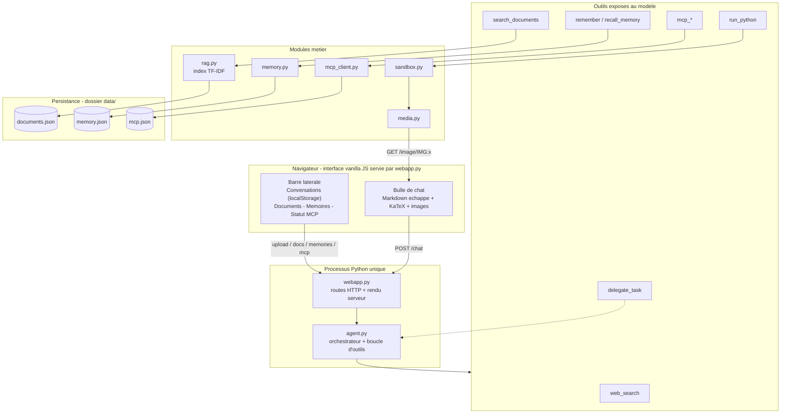
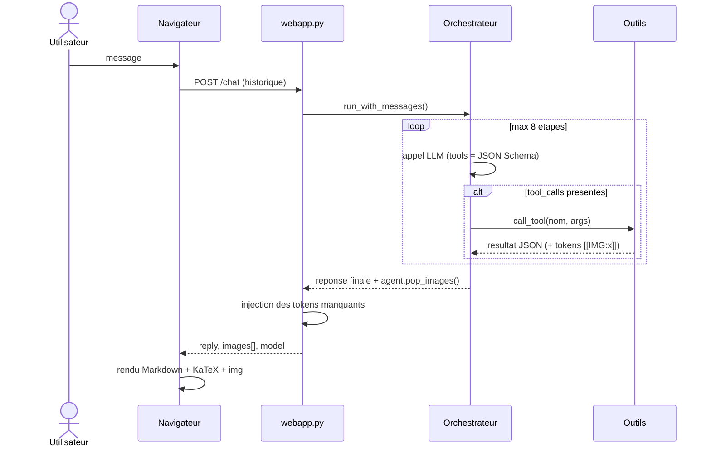
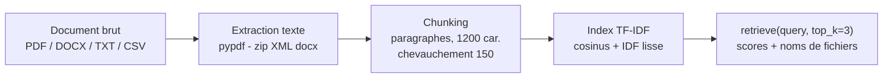
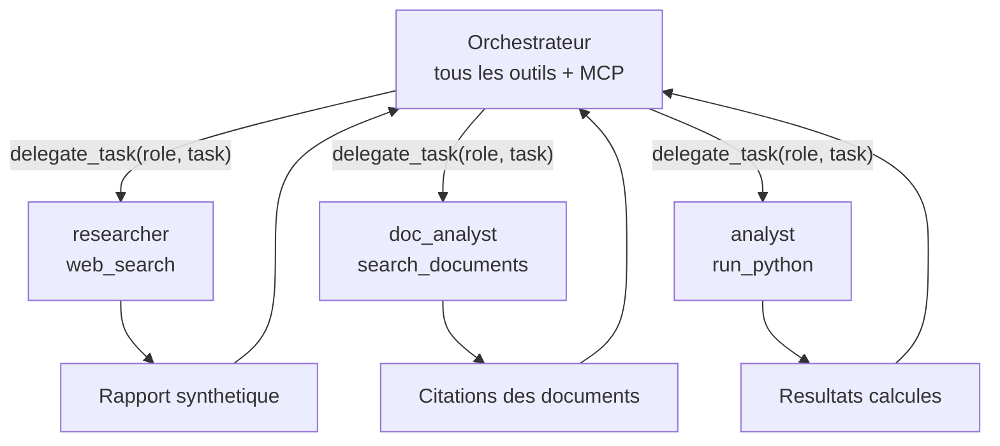
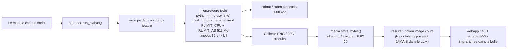
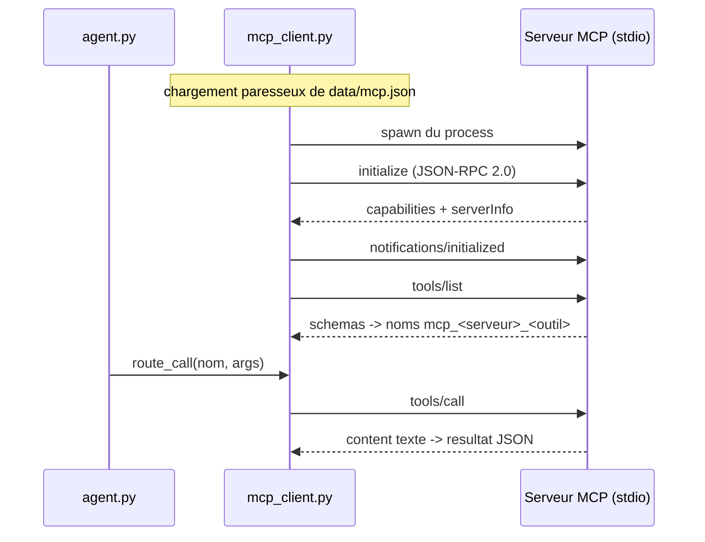
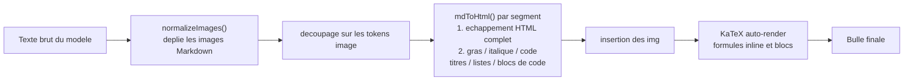

# Architecture — AI Services

Agent IA conversationnel **sans framework** : boucle tool-calling maison, multi-provider,
RAG sur documents, mémoire long terme, interpréteur de code sandboxé avec affichage de
graphiques dans le chat, sous-agents spécialisés et outils externes MCP.

---

## 1. Vue d'ensemble

Un seul processus Python héberge tout : le serveur web, l'agent, les modules métier et
les connexions MCP. C'est ce qui permet le pipeline d'images sans stockage externe.

---

## 2. Flux d'une requête de chat

Point clé : les images produites par la sandbox sont captées **à la source** (buffer
thread-local) puis réinjectées dans la réponse même si le modèle oublie de mentionner
le token. L'affichage ne dépend pas de la discipline du modèle.

---

## 3. L'orchestrateur (`agent.py`)

- **Multi-provider** : Ollama, Groq, OpenRouter, OpenAI — toute API compatible OpenAI
  (`/chat/completions`), sélection par variables d'environnement.
- **Boucle d'outils** (`run_loop`) : jusqu'à `max_steps` allers-retours ; chaque
  `tool_call` est exécuté puis renvoyé au modèle au format `role: tool`.
- **Robustesse** : retry avec backoff exponentiel sur 408/429/5xx, timeout global,
  messages d'erreur traduits pour l'utilisateur (plus de jargon provider).
- **Anti-hallucination** : le prompt système impose de ne rapporter que ce que les
  outils confirment.

## 4. Les outils

| Outil | Module | Rôle |
|---|---|---|
| `web_search` | DuckDuckGo (optionnel) | recherche web, top 3 résultats |
| `search_documents` | `rag.py` | recherche TF-IDF cosinus dans les documents uploadés |
| `remember` / `recall_memory` | `memory.py` | mémoire long terme par recouvrement de mots-clés |
| `run_python` | `sandbox.py` | exécution Python isolée, graphiques affichables |
| `delegate_task` | `agent.py` | délégation à un sous-agent spécialisé |
| `mcp_<serveur>_<outil>` | `mcp_client.py` | outils externes découverts dynamiquement |

### RAG (`rag.py`)

- Max 5 documents, déduplication par nom, persistance JSON, rechargement à chaud.
- Sanitisation des noms de fichiers (anti path traversal).

### Sous-agents (`delegate_task`)

- Chaque sous-agent a son **system prompt** dédié et une **allow-list d'outils stricte**.
- `delegate_task` n'existe pas dans leur outillage : la récursion est impossible par construction.
- Budget propre : 6 étapes maximum, trace des outils utilisés renvoyée à l'orchestrateur.

---

## 5. Sandbox & pipeline d'images

Pourquoi ce design :

1. **Sécurité** : pas de `exec()` dans le processus serveur ; CPU/RAM plafonnés (POSIX),
   kill automatique du code fou, backend matplotlib forcé en `Agg` (headless).
2. **Contexte LLM** : un graphique de 500 Ko en base64 coûterait ~170 000 tokens ;
   le modèle ne voit qu'un token de 14 caractères.
3. **Fiabilité** : buffer thread-local + `pop_images()` — l'image s'affiche même si le
   modèle paraphrase le token en `` (normalisé côté client).

---

## 6. Outils externes MCP (`mcp_client.py`)

- Protocole : JSON-RPC 2.0 sur stdin/stdout, lecteur asynchrone par serveur.
- **Isolation des pannes** : un serveur qui refuse de démarrer est affiché en rouge dans
  la sidebar et sauté — jamais d'impact sur le reste de l'app.
- Sans `data/mcp.json`, la fonctionnalité reste simplement éteinte.

---

## 7. Rendu côté client

L'échappement HTML précède toujours l'injection de balises : aucun contenu (modèle ou
utilisateur) ne peut exécuter de JavaScript (anti-XSS). KaTeX charge depuis un CDN ;
hors ligne, la notation brute reste lisible.

## 8. Persistance

| Donnée | Stockage | Volatilité |
|---|---|---|
| Conversations | `localStorage` (navigateur) | persistant |
| Documents RAG | `data/documents.json` | persistant |
| Mémoires | `data/memory.json` | persistant |
| Config MCP | `data/mcp.json` (gitignore) | persistant |
| Images générées | mémoire vive, FIFO 30 | perdue au redémarrage |
| Connexions MCP | processus fils | relancées à chaque démarrage |

## 9. Sécurité — mesures en place

| Risque | Parade |
|---|---|
| Code arbitraire via `run_python` | subprocess isolé `-I`, rlimits CPU/RAM, timeout + kill, cwd jetable |
| Path traversal (upload) | sanitisation `basename`, extensions whitelistées, max 5 docs |
| XSS via réponses du modèle | échappement HTML systématique avant rendu, balises contrôlées uniquement |
| Satération du contexte LLM | sortie tronquée à 6000 car., images réduites à des tokens |
| Crash par serveur MCP défaillant | isolation par try/except, statut visible, app toujours fonctionnelle |

## 10. Choix d'architecture

- **Sans framework** (pas de LangChain/LlamaIndex) : chaque brique fait ~100-300 lignes
  lisibles ; comportement 100 % prévisible et débogable.
- **Un seul process** : zéro dépendance d'infra (pas de Redis/S3/vecteurs externes) ;
  l'index TF-IDF maison suffit à cette échelle (≤ 5 docs).
- **Tests de bout en bout** (`test_system.py`) : y compris un faux serveur MCP complet
  qui valide le protocole JSON-RPC sans réseau.

